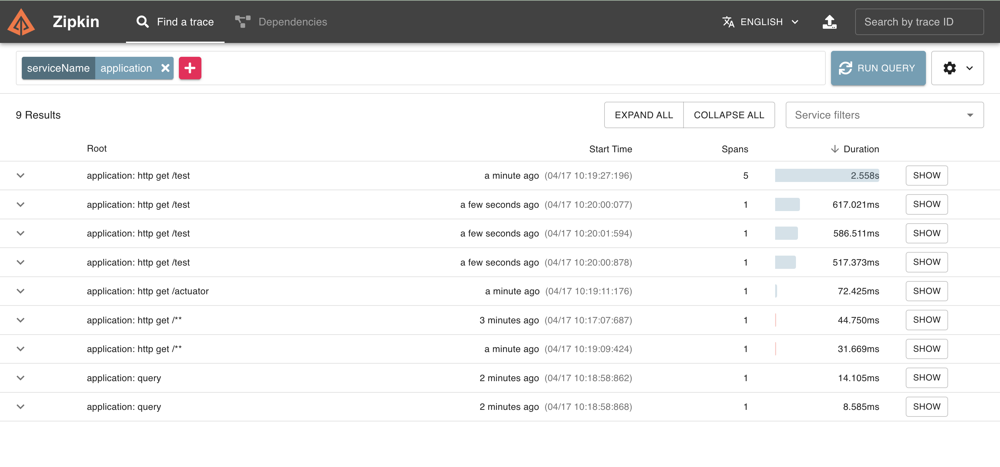
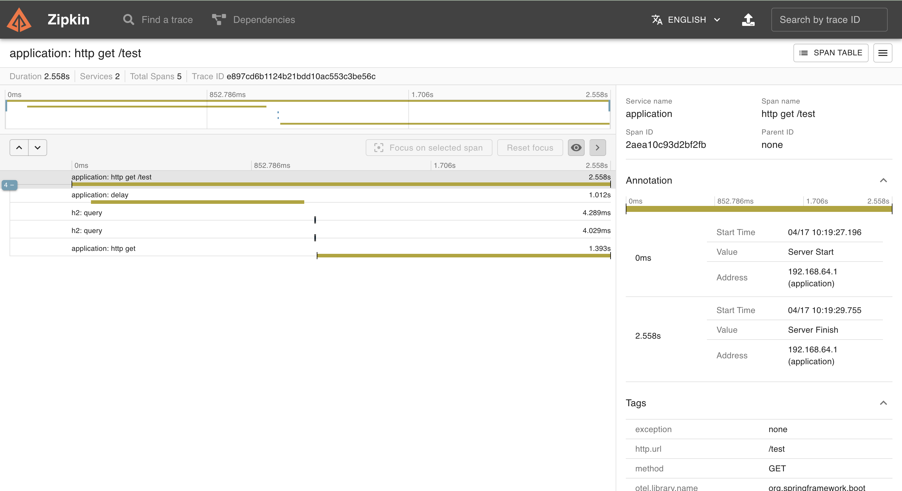

# spring-boot-kotlin-tracing-example

This repository contains a simple demo application showing the usage
of [Micrometer Tracing](https://micrometer.io/docs/tracing).

It contains the following features:

- [Spring Boot 3 Webflux](https://docs.spring.io/spring-framework/docs/current/reference/html/web-reactive.html)
- [Micrometer Tracing](https://micrometer.io/docs/tracing)
- [Zipkin tracing export](https://github.com/open-telemetry/opentelemetry-java/tree/main/exporters/zipkin)
- [R2DBC Database Tracing](https://github.com/spring-projects-experimental/r2dbc-micrometer-spring-boot)
- Reactive logs with tracing data
- Custom observations in reactive streams

Zipkin Home Page



Zipkin App Page



## Requirements

- JVM 1.7+
- Docker
### Things todo list

1. Clone this repository: `git clone https://github.com/hendisantika/spring-boot-kotlin-tracing-example.git`
2. Navigate to the folder: `cd spring-boot-kotlin-tracing-example`
3. Start Zipkin Tracer via
   ```shell
   docker run -p 9411:9411 openzipkin/zipkin
   ```
4. Start application with
   ```shell
   ./gradlew clean :bootRun
   ```` 
5. Call test endpoint: http://localhost:8080/test
6. Call actuator endpoint: http://localhost:8080/actuator
7. Open Zipkin UI and query for traces: http://localhost:9411/zipkin/
   
   
